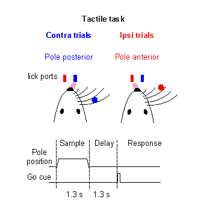
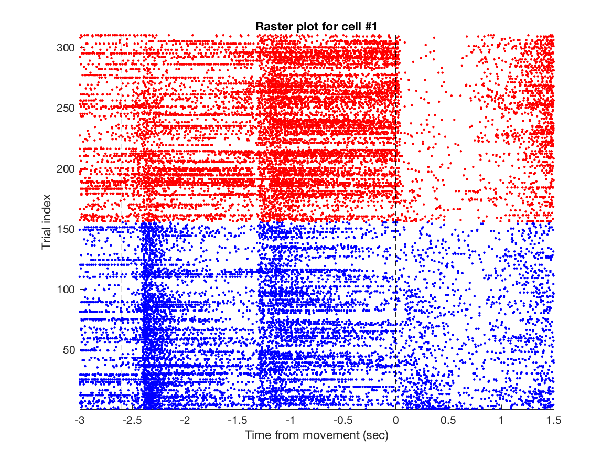
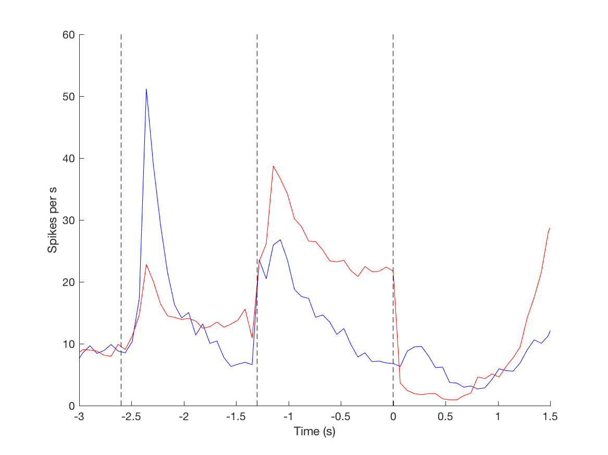
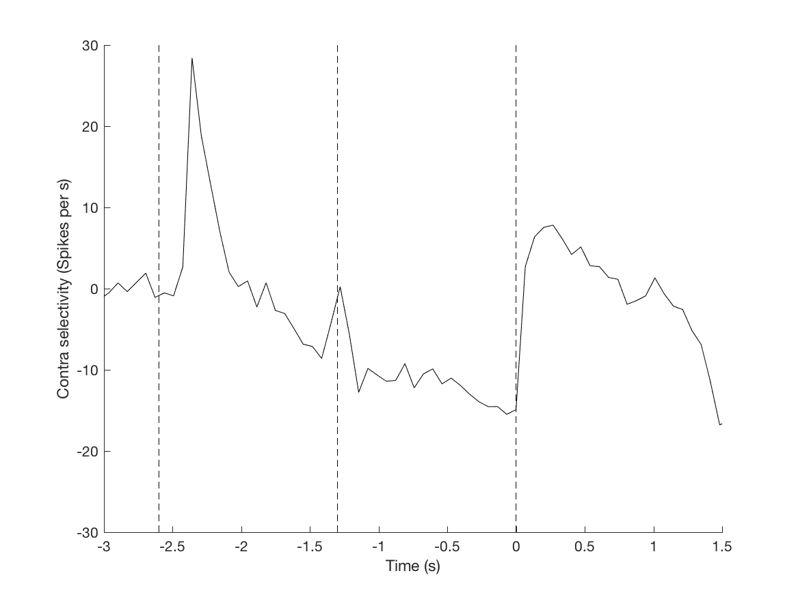
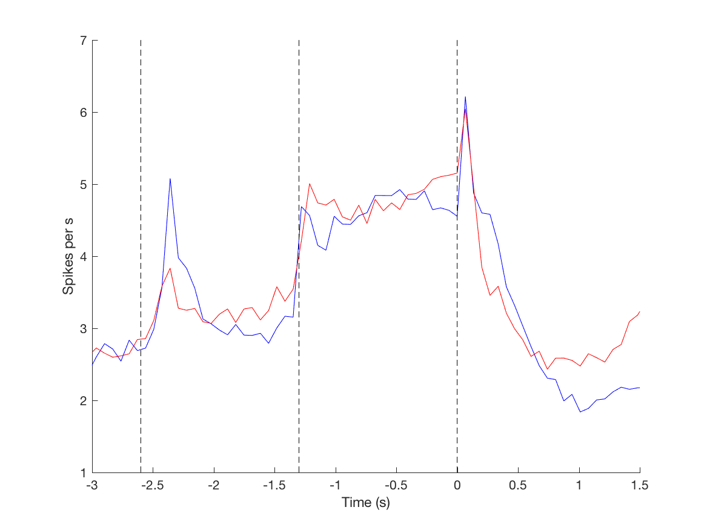
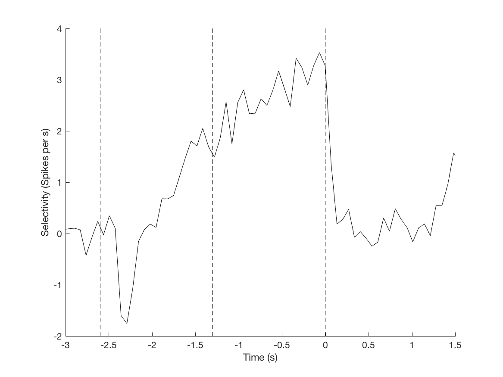
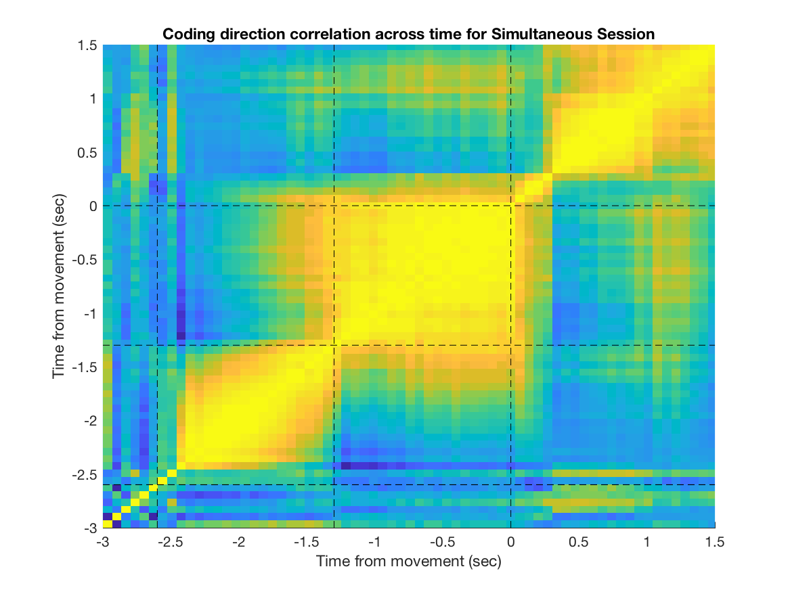
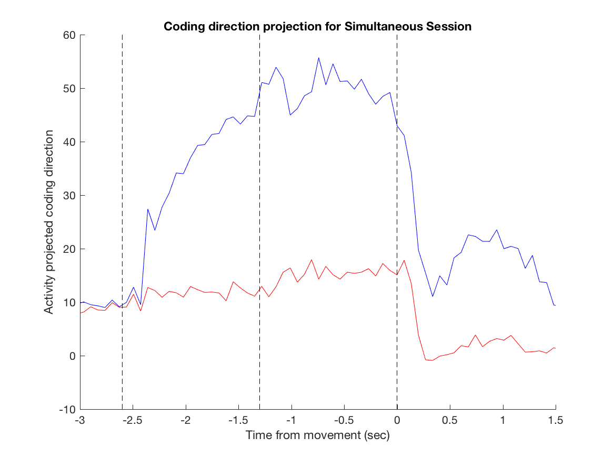
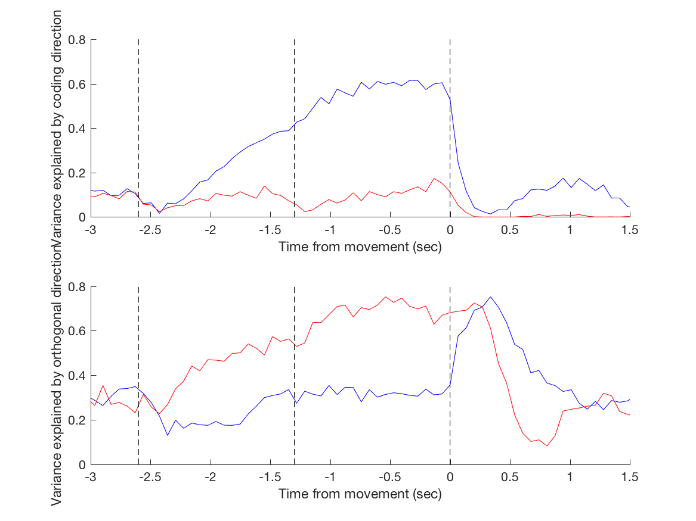

# Exploring extracellular electrophysiology data
This repo if for the JHU Neuroscience bootcamp, day 1, extrecellular neurophysiology (08/21, 2017).
The goal is to analyze extracellular electrophysiology data acquired in a delayed reponse task. This set of exercises is in Matlab. 
* See "Dataset description" for the structure of the data, including behavior and electrophysiology.
* See "Data access" for code to load and manipulate data.
* The remainder of the sections if about the analyses to be performed.


## Dataset Description
### Task description:
The data set was acquired in mice performing a "tactile delayed response task". Recordings were made in the premotor cortex using 64ch silicon probes (for more information see Guo, Z, Li, N et al 2014 Neuron; Li, N, Daie, K et al 2016 Nature; included in the repository).
* An object was presented to the whiskers during a "sample epoch". The location of the object instructs the animal which direction to lick (left or right). Because recordings were in left hemisphere, left and right are referred to as ipsi and contra directions.
* The sample epoch was followed by a "delay epoch", during which the mouse has to maintain a memory of future licking direction.
* At the end of the delay epoch, and signaling the beginning of a "response poch", a brief "go cue" (100ms)instructs the animal to move.
* When the animal licks in the correct direction it receives water reward (correct trials). Licking in the wrong direction results in reward omission (error trials). 
* Neurons in premotor cortex show preparatory activity during the delay epoch. Preparatory activity is the neural correlate of motor planning. Preparatory activity corellates with movements, sometimes long before the movements occurr. Let's analyze preparatory activity both at the single neuron and population level.



### Task structure:
* Pre-sample : -3.1 to -2.6 sec.
* Sample     : -2.6 to -1.3 sec.
* Delay      : -1.3 to  0.0 sec.
* Response   :  0.0 to  2.0 sec.

### Data structure:
This repo contains data from 5 recording sessions. Each session contains hundreds of behavioral trials with different trial types. Multiple units (neurons) were recorded simultaneously. We did not provide the raw extracellular waveforms, but only  'sorted' spikes. The process (some would say dark art) of 'spike sorting' is beyond the scope of this tutorial.  

* Spikes are stored in a structure array named __ephysDataset__. The data set has 125 units, each with its own structure. 
* sessionIndex: index of the session in which each neuron was recorded. For example, the first 26 units all derive from session 1.  
* nUnit       : index of the neuron(unit) in each recording session. nUnit for the first 26 units runs from 1-26, and then resets to 1 for the first unity of session 2, etc.
* unit_yes_trial: spike rate in correct right-lick trial. Spikes were binned into 67 ms bins.
* unit_no_trial : spike rate in correct left-lick trial. Spikes were binned into 67 ms bins.
* unit_yes_trial_index: trial index of each correct right-lick trial.
* unit_no_trial_index : trial index of each correct left-lick trial.
* unit_yes_trial_spk_time: time of each spike in correct right-lick trials (sec).
* unit_no_trial_spk_time : time of each spike in correct left-lick trials (sec).

* unit_yes_error: spike rate in error right-lick trial. Spikes were binned into 67 ms bins.
* unit_no_error : spike rate in error left-lick trial. Spikes were binned into 67 ms bins.
* unit_yes_error_index: trial index of each error right-lick trial.
* unit_no_error_index : trial index of each error left-lick trial.
* unit_yes_error_spk_time: time of each spike in error right-lick trials (unit in sec).
* unit_no_error_spk_time : time of each spike in error left-lick trials (unit in sec).

* depth_in_um: recording depth of the unit in um. We don't use this info here.
* cell_type  : putative pyramidal cells -- 1; fast-spiking interneurons: 0.
* __timetag__    : timing of each bin (67 ms discrete time bins).
* __simDataset__ : Dataset for "Dimensionality reduction". See "Dimensionality reduction" for detail. 

## Data access
#### Load data file
```matlab
load('ephysDataset.mat')
```

#### Get session and unit indices for a neuron
```matlab
    cell_idx = 100; % cell at 100th row of the ephysDataset array
    seesionInfo = ephysDataset(cell_idx).sessionIndex;
    unitInfo = ephysDataset(cell_idx).nUnit;
```
##### Extra
* Try the code for another neuron and report its recording session and its unit index.
* Try the code for the same neuron and report its location in depth and cell type.

#### Get spike counts for a neuron in one of lick-right trials
```matlab
cell_idx = 100; % cell at 100th row of the ephysDataset 
nTrial = 2; % the second lick-right trial
psth = ephysDataset(cell_idx).unit_yes_trial(nTrial,:);
```
##### Extra
* Try the code for another trial of the same cell in correct right-lick, correct left-lick, error right-lick, and error left-lick conditions.

#### Get timing of each bin for the spike counts
```matlab
timetag;
```

#### Get spike times for a neuron in one of the lick-right trials
```matlab
cell_idx = 1; % cell at 1st row of the ephysDataset 
nTrial = 2; % the second lick-right trial
spkTime = ephysDataset(cell_idx).unit_yes_trial_spk_time{nTrial};
```
##### Extra
* Try the code for another trial of the same cell in correct right-lick, correct left-lick, error right-lick, and error left-lick conditions. 

#### Run all analyses (see code tasks as follow)
```matlab
all_compiled;
```

## Cell-based analyses
### Plot rasters
* Plot each spike in a single trial as a dot (see also __Data access__ for detail)
```matlab
cell_idx = 100; % cell at 100th row of the ephysDataset 
nTrial = 10; % the second lick-right trial
spkTime = ephysDataset(cell_idx).unit_yes_trial_spk_time{nTrial};
figure;
plot(spkTime, ones(size(spkTime)), '.');
```

* Now plot spikes in all correct right and left trials. Trials arrayed in the vertical dimension, time in the horizontal dimension
* Example code and result are shown below.
```matlab
plot_raster
```
</img>
### Estimate mean spike rate for different trial types
* First we plot spike rates in a single trial of an example cell 
```matlab
cell_idx = 1; % cell at 1st row of the ephysDataset 
nTrial = 10; % the second lick-right trial
psth = ephysDataset(cell_idx).unit_yes_trial(nTrial,:);
figure;
plot(timeTag, psth);
```
* Extra - Create spike count 

* Next, plot mean peri-stimulus histogram (PSTH): average spike rates among trials using _mean_ function.
```matlab
cellId = 1; % cell to plot
meanR = mean(ephysDataset(cellId).unit_yes_trial,1); % mean PSTH of lick R trial
meanL = mean(ephysDataset(cellId).unit_no_trial,1);  % mean PSTH of lick L trial
figure
hold on
plot(timeTag,meanR,'b')
plot(timeTag,meanL,'r')
gridxy([-2.6 -1.3 0],'Color','k','Linestyle','--') ; % plot timing of each epoch
xlim([-3  1.5]); % range of X axis
xlabel('Time (s)')
ylabel('Spikes per s')
hold off
```
</img>

### Compute selectivity
* selectivity is defined as spike rate difference between two trial types
```matlab
meanR - meanL
```
* Plot selectivity of each neuron and do statistical test (ranksum test comparing two trial types)
* example code and result 
```matlab
plot_PSTH_with_selectivity
```
</img>
### Extra - Fano Factors
```matlab
plot_ff
```
* Fano factor for a trial-type at a time bin is defined as the variance of spike counts over its mean
https://en.wikipedia.org/wiki/Fano_factor . To convert spike rate to spike counts, one needs to normalize
it with the size of the time bin (sampleRate) in the following code. For correct lick-right condition:
```matlab
sampleRate = 14.84;
meanR = mean(ephysDataset(cellId).unit_yes_trial,1)/sampleRate;
varR  = var(ephysDataset(cellId).unit_yes_trial,1)/sampleRate^2;
FF_R  = varR./meanR;
```
</img>
* Extra - does Fano Factor increase or decrease during the delay epoch? Compare Sample epoch, Early Delay and Late Delay
### Error trial analysis — is activity similar or different?
* Run analyses above using error trials.


## Session-based analysis (i.e. across neurons recorded simultaneously in a session)

### Grand average --  spike rate (sr)
* Tips: using __for__ loop to compute mean spike rate for correct trials in lick-right and left conditions for each cell
* Tips: average across cells in each condition

</img>
### Grand average selectivity,(correct trials only)
* Tips: Flip selectivity if it is negative during the delay epoch.

</img>
### Grand average, abs(sr(R) - sr(L))

* Example code
```matlab
plot_session_PSTH_with_selectivity
```

## Dimensionality reduction
### Data
Data is in a structure array named __simDataset__ . This is a single session data. Fourteen neurons were simultaneously recorded. You need to use 2 field described below for the analysis. Ignore others.
* unit_yes_trial : Spike rate of lick R trials in [trial, neuron, tim bin] format. There are 115 trials, 14 neurons, 77 time bin.
* unit_no_trial  : Spike rate of lick R trials in [trial, neuron, tim bin] format. There are 94 trials, 14 neurons, 77 time bin.

### Find the coding direction - CD
* This is the direction in activity space where trial types can best be discriminated

* We will use the simplest definition:

 sr_R(i)-sr_L(i)

where sr_R is spike rate in lick-right trials, sr_L is spike rate in lick-left trials, and i is the cell index.
Calculate this vector for each time point, then normalize (divide by norm) to produce a unit vector.


* Explore correlation of coding direction across time

</img>

* Explore neural activity projected to coding direction
* To project population activity to CD, calculate inner dot: sr_R * CD.

</img>

* Do SVD; use Gram-Schmitt procedure to rotate the space to be orthogonal to CD using function __func_orthrog_vectors__

</img>

* Related reference: Nuo Li, Kayvon Daie,	Karel Svoboda	& Shaul Druckmann (Nature, 2016) http://www.nature.com/nature/journal/v532/n7600/full/nature17643.html

* Example code
```matlab
plot_CD_sim
```

### Extra - dPCA: download code from Machens website
* https://github.com/machenslab/dPCA
* Copy functions __dpca_explainedVariance__, __dpca_marginalize__ and __dpca__ to the current folder

```matlab
plot_dpca
```
</img>

* Related reference: D Kobak, W Brendel, C Constantinidis, CE Feierstein, A Kepecs, ZF Mainen, X-L Qi, R Romo, N Uchida, CK Machens (eLife 2016) https://elifesciences.org/content/5/e10989
